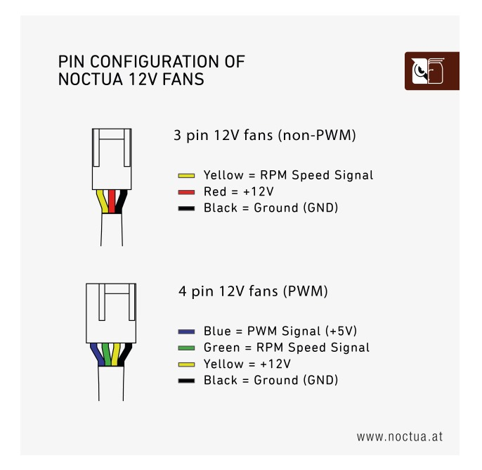

# PM2.5 Controlled Fan System for Plantower PMS7003 Sensor

## Overview
This Arduino-based system dynamically adjusts a 4-wire PWM fan's speed based on real-time PM2.5 air quality readings from a Plantower PMS7003 sensor. The system features progressive speed control with 6 pollution tiers and PWM-based fan regulation.

## Hardware Setup

### 4-Wire Fan Connections
| Wire Color | Purpose          | Connection       | Details                                                                 |
|------------|------------------|------------------|-------------------------------------------------------------------------|
| Green     | RPM (Tachometer) | Not Connected*   | Outputs square wave (frequency ∝ RPM) for speed monitoring [2][6]      |
| Blue      | PWM Control      | GPIO4 (D3)       | Input for PWM signal (duty cycle controls speed) [3][6]                |
| Yellow        | 12V Power        | 12V Supply       | Main power input (ensure current rating matches fan requirements)      |
| Black      | Ground           | GND              | Common ground for circuit completes electrical path [1]                |



*RPM monitoring not implemented in current code

### Sensor Connections
- PMS7003 UART TX → Arduino RX (D2 in this implementation)
- 5V/VCC → 5V
- GND → GND

## Code Explanation

### Key Components

```cpp
// PWM Configuration
const int pwmPin = 4; // GPIO4 (D3) for PWM output
int fanSpeed = 10; // Default speed (0-100%)
int fanSpeedAnalog = map(fanSpeed, 0, 100, 0, 255); // Convert to 8-bit PWM
```

### Speed Control Logic

```cpp
void speedControl(int pm25) {
    Serial.print("Adjusting fan speed based on PM2.5: ");
    Serial.println(pm25);

    if (pm25 < 15) {
        fanSpeed = 30; // Very low fan speed
    }
    else if (pm25 >= 15 && pm25 < 50) {
        fanSpeed = 45; // Low fan speed
    }
    else if (pm25 >= 50 && pm25 < 100) {
        fanSpeed = 60; // Moderate fan speed
    }
    else if (pm25 >= 100 && pm25 < 150) {
        fanSpeed = 70; // High fan speed
    }
    else if (pm25 >= 150 && pm25 < 200) {
        fanSpeed = 90; // Very high fan speed
    }
    else {
        fanSpeed = 100; // Maximum fan speed
    }

    int fanSpeedAnalog = map(fanSpeed, 0, 100, 0, 255);  // Map percentage to analog value
    analogWrite(pwmPin, fanSpeedAnalog);  // Apply PWM to fan
    Serial.print("PWM value on GPIO4 (D3): ");
    Serial.println(fanSpeedAnalog);

    Serial.print("Fan Speed Set To: ");
    Serial.print(fanSpeed);
    Serial.println("%");
}
```


### PWM Operation
- Uses Arduino's 8-bit PWM resolution (0-255)
- 100% duty cycle = 255 = full speed
- 30% speed = 76.5 → rounded to 77 (actual PWM value)
- Frequency determined by Arduino's base PWM frequency (≈490Hz default) [5][6]

## Installation Requirements
1. Arduino IDE 1.8.x or newer
2. Required Libraries: None, for this section of the code.

## Calibration Notes
1. PM2.5 thresholds based on WHO air quality guidelines
2. Adjust thresholds in `speedControl()` for:
   - Different fan models
   - Specific airflow requirements
   - Local air quality standards
3. Use serial monitor (`115200 baud`) for real-time debugging

## Safety Considerations
- Ensure proper 12V power supply rating
- Maintain ground connection integrity [1]
- Avoid PWM frequencies above 25kHz [3]
- Keep fan blades clear of obstructions

## Expansion Capabilities
1. Add RPM monitoring via interrupt pin
2. Implement temperature compensation
3. Add humidity-based speed adjustments
4. Develop mobile/web interface through Firebase

*Actual wiring may vary based on specific component models*

[DC Fan](https://www.amazon.in/Noctua-NF-P12-redux-1700rpm-4-pin-Cabinet/dp/B07CG2PGY6/ref=sr_1_29?s=computers&sr=1-29)